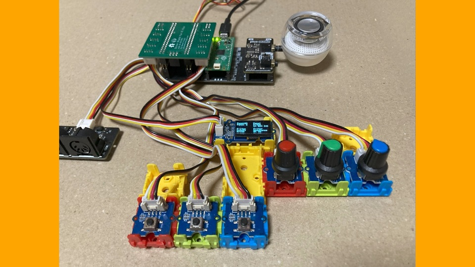
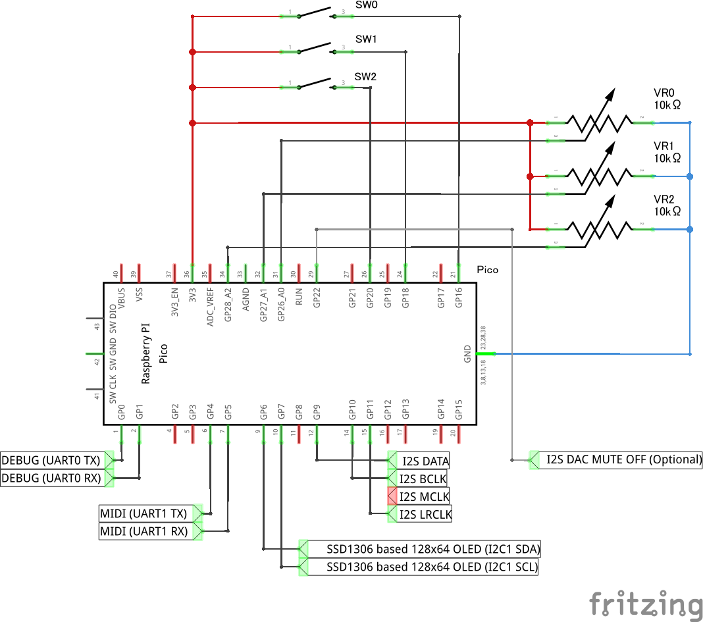
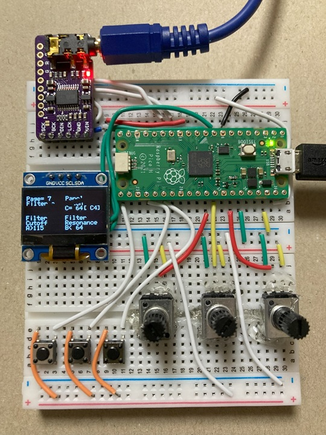

# Digital Synth PRA32-U with Panel v3.1.0

- 2025-01-19 ISGK Instruments
- <https://github.com/risgk/digital-synth-pra32-u>

## PRA32-U with Panel (Optional)

- Features
    - Edit and display parameters by panel operation
    - Playing by panel operation
    - Built-in monophonic 8-step sequencer
    - Panel and Step Sequencer Parameters
- This option requires 3 SWs (tactile switches), 3 VRs (ADCs), and a monochrome 128x64 OLED Display based on SSD1306 series drivers
    - Tested with Pimoroni Pico Audio Pack, necobit電子 MIDI Unit for GROVE (optional), Long Leg 2x20 Pin Socket * 2, Seeed Studio's Grove Shield for Pi Pico, Buttons * 3, Rotary Angle Sensors * 3, and an OLED Display 0.96 inch
- Uncomment out `//#define PRA32_U_USE_CONTROL_PANEL` in "Digital-Synth-PRA32-U.ino" and modify the constants
- Inputs
    - SW0: Prev Key (Push to the previous page, Long press to the previous group)
    - SW1: Next Key (Push to the next page, Long press to the next group)
    - SW2: Play Key (Normal Mode: press to play, Sequencer Mode: push to start/stop)
    - VR0 (ADC0): Parameter A
    - VR1 (ADC1): Parameter B
    - VR2 (ADC2): Parameter C
- Group A
    - Synth Parameters
- Group B
    - Panel Parameters
        - Panel Play Mode [Nrm|Seq]: Normal Mode, Step Sequencer Mode
        - Panel MIDI Ch: Basic Channel 1-16
        - Panel Play Pitch: min 4 to max 124
        - Panel Play Velo (Velocity)
        - Panel Scale [Maj|Min|Mel|MaP|MiP|Chr]: Major, Natural Minor, Ascending Melodic Minor (Jazz Minor), Major Pentatonic, Minor Pentatonic, Chromatic (2 octaves)
        - Panel Pitch Ofst (Pitch Offset) [-|+]: Offset Panel Play Pitch and Seq Pitch 0-7 (min -60 to max +60)
            - For example, if Panel Scale is Maj and Panel Pitch Ofst is -25, the scale is G Mixolydian
            - For example, if Panel Scale is Maj and Panel Pitch Ofst is -15, the scale is A Aeolian (Natural Minor)
            - For example, if Panel Scale is Maj and Panel Pitch Ofst is +10, the scale is D Dorian
            - For example, if Panel Scale is Maj and Panel Pitch Ofst is +20, the scale is E Phrygian
            - For example, if Panel Scale is Maj and Panel Pitch Ofst is +25, the scale is F Lydian
        - Panel Transpose [-|+]
            - For example, if Panel Scale is Mel and Panel Transpose is -3, the scale is A Ascending Melodic Minor (Jazz Minor)
            - For example, if Panel Scale is Min and Panel Transpose is -3, the scale is A Natural Minor
            - For example, if Panel Scale is MiP and Panel Transpose is -3, the scale is A Minor Pentatonic
    - Step Sequencer Parameters
        - Seq Mode [Fwd|Rvs|Bnc]: Forward, Reverse, Bounce
        - Seq Num Steps (Number of Steps): 1-32 (current step mod 8 is used as the index for Seq Pitch and Seq Velo)
        - Seq On Steps: bit 0 is Step 1 On, ..., bit 6 is Step 7 On (Step 0 is always On)
        - Seq Act Steps (Active Steps): bit 0 is Step 1 Active, ..., bit 6 is Step 7 Active (Step 0 is always Active)
        - Seq Step Note [4|8|16]: Quarter Note, Eighth Note, Sixteenth Note
        - Seq Tempo: BPM 30-300
        - Seq Gate Time [1/6|2/6|3/6|4/6|5/6|6/6]
        - Seq Transpose [-|+]
        - Seq Clock Src [Int|Ext]: Internal, External (Rx MIDI Clock)
        - Seq Pitch 0-7: min 4 to max 124
        - Seq Velo 0-7 (Velocity 0-7)
    - Step Sequencer Function
        - Seq Rand Pitch (Randomize Pitch 0-7): Change the value from 0-63 [Rdy] to 64-127 [Exe]
        - Seq Rand Velo (Randomize Velo 0-7): Change the value from 0-63 [Rdy] to 64-127 [Exe]
    - Control Parameters
        - Modulation
        - Breath Controller
        - Sustain Pedal
- Group C
    - Write Operations
        - Write Program 8-15, Write Panel Prms (Write Panel and Step Sequencer Parameters)
            - Change the value from 0-63 [Rdy] to 64-127 [Exe] to write to the flash
- Group D
    - Read Operations
        - Read Program 1-7, 8-15, Read Panel Prms, Init Panel Prms
            - Change the value from 0-63 [Rdy] to 64-127 [Exe]
- NOTE: UART MIDI control is recommended to prevent ADCs from being affected by USB MIDI communication noise
- NOTE: Specifications may change significantly in the future to read from the flash

### Circuit Diagram

- This image was created with Fritzing.

### An Example of Construction by a Breadboard

- Tested with a breadboard, GY-PCM5102 (PCM5102A I2S DAC Module), 3 SWs, 3 VRs, and a OLED Display
    - An connection between RP2040's Mute Off Pin and GY-PCM5102's XSMT is omitted

