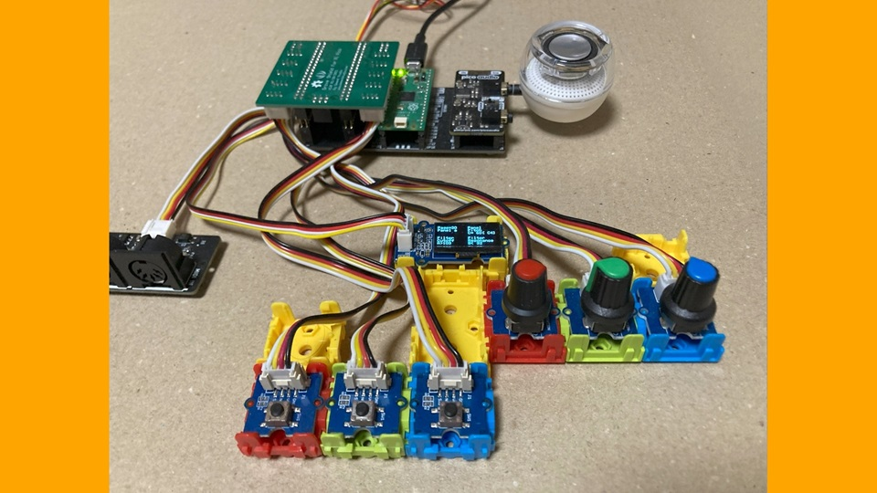

# PRA32-U with Panel

- 2024-04-21 ISGK Instruments
- <https://github.com/risgk/digital-synth-pra32-u>

## PRA32-U with Panel, Prototype 1 (Experimental) (Optional)

- Uncomment out `//#define PRA32_U_USE_CONTROL_PANEL` in "Digital-Synth-PRA32-U.ino" and modify options
- This option requires 3 tactile switches, 3 VRs (ADCs), and a monochrome 128x64 OLED Display based on SSD1306 series drivers
    - Tested with Pimoroni Pico Audio Pack, necobit電子 MIDI Unit for GROVE, Long Leg 2x20 Pin Socket * 2, Seeed Studio's Grove Shield for Pi Pico, Buttons, Rotary Angle Sensors, and a OLED Display 0.96 inch
- Inputs
    - SW0: Prev Key (to the previous page, long press to the previous group)
    - SW1: Next Key (to the next page, long press to the next group)
    - SW2: Play Key (play notes)
    - VR0 (ADC0): Parameter A
    - VR1 (ADC1): Parameter B
    - VR2 (ADC2): Parameter C
- Panel Parameters
    - Panel Pitch
    - Panel Scale [Ful|Chr|MiP|MaP|Min|Maj]
        - Full = Chromatic, 10 + 7/12 octaves
        - Chromatic, 2 octaves
        - Minor Pentatonic, 2 octaves
        - Major Pentatonic, 2 octaves
        - Minor, 2 octaves
        - Major, 2 octaves
    - Panel Transpose [-|+]
    - Panel Velocity
- Other Operations
    - Write Program 8-15: Change the value from 0 [Rdy] to 127 [Exe]
    - Read Program 1-7, 8-15: Change the value from 0-63 [Rdy] to 64-127 [Exe]
- NOTE: Specifications may change significantly in the future

### Circuit Diagram (PRA32-U with Panel)

- This image was created with Fritzing.
