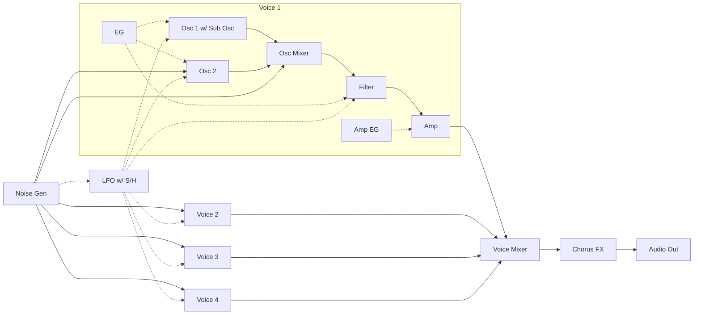
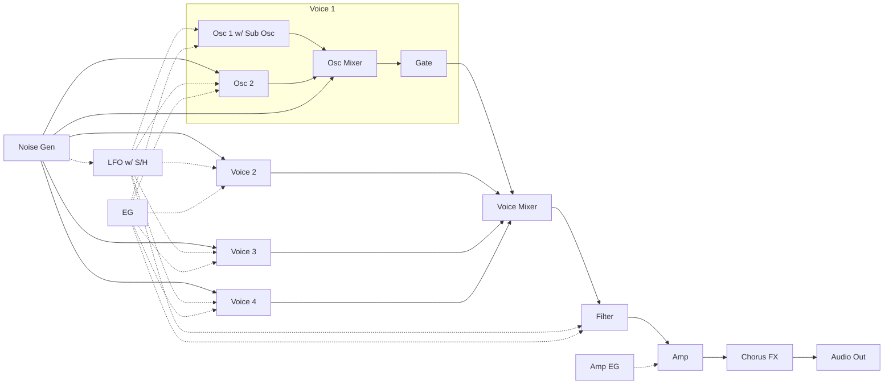
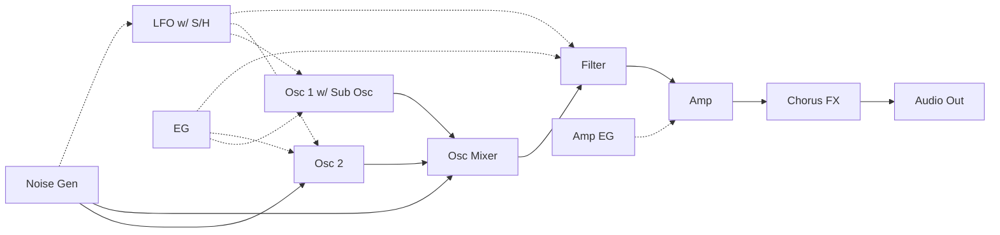

# Digital Synth PRA32-U v0.2.0 (Prototype)

- 2023-08-16 ISGK Instruments
- <https://github.com/risgk/digital-synth-pra32-u>


## Overview

- 4 Voice Polyphonic/Paraphonic Synthesizer for Raspberry Pi Pico/RP2040
    - Built-in Chorus FX
    - Controlled by MIDI -- PRA32-U is a MIDI sound module
- An **I2S DAC** hardware (e.g. Pimoroni Pico Audio Pack and Waveshare Pico-Audio) is required
    - **NOTE**: Large noise is generated during the sketch upload!
- **Arduino IDE** and **Arduino-Pico** = **Raspberry Pi Pico/RP2040** (by Earle F. Philhower, III) core are required
    - Additional Board Manager URL: <https://github.com/earlephilhower/arduino-pico/releases/download/global/package_rp2040_index.json>
    - Raspberry Pi Pico/RP2040 core **version 3.3.2** is recommended


## Change History

- v0.3.0 (Prototype): Remove drift of Oscillators; Change EG curve; Extend LFO Rate change range; Change LFO Fade Time;
  Fix Filter Key Track (Fix problem with strange sound when pitch is outside of note number range);
  Fix behavior when Portamento is 0 (Off); Update Presets
- v0.2.0 (Prototype): Change Sampling Rate to 48000 Hz; Support MCLK for I2S; Support Polyphonic Mode;
  Extend Filter Cutoff frequency change range to 10+ octaves;
  Change "Mixer Sub Osc" to "Mixer Noise/Sub Osc"; Add "EG Amp Mod", "Release = Decay", and "Filter Mode";
  Enable Osc 1 Shape, Morph, Noise/Sub Osc, and Osc 2 in Paraphonic and Polyphonic Modes; Other changes
- v0.1.0 (Prototype): The first release


## Features

### MIDI In

- USB MIDI is the default
    - MIDI Device Name: "Digital Synth PRA32-U"
    - **NOTE**: Select USB Stack: "Adafruit TinyUSB" in the Arduino IDE "Tools" menu
    - **KNOWN ISSUE**: When using some USB MIDI host hardware and communicate a lot, this device may miss MIDI messages
- Serial MIDI can also be used instead of USB MIDI
    - Comment out `#define USE_USB_MIDI` and uncomment out `//#define USE_SERIAL1_MIDI`
      in "Digital-Synth-PRA32-U.ino" and modify `SERIAL1_MIDI_SPEED`
    - Speed: 31.25 kbps (default) or 38.4 kbps
    - GP0 and GP1 pins are used by UART0 TX and UART0 RX
    - DIN/TRS MIDI is available by using (and modifying) Adafruit MIDI FeatherWing Kit, for example
        - Adafruit [MIDI FeatherWing Kit](https://www.adafruit.com/product/4740)
        - necobit電子 [MIDI Unit for GROVE](https://necobit.com/denshi/grove-midi-unit/) (Shipping to Japan only)
        - 木下研究所 [MIDI-UARTインターフェースさん キット](https://www.switch-science.com/products/8117) (Shipping to Japan only)


### Audio Out

- Use an I2S DAC (e.g. Texas Instruments PCM5100A and Cirrus Logic CS4344), Sampling Rate: 48 kHz, Bit Depth: 16 bit
- **NOTE**: The RP2040 system clock (sysclk) changes to overclocked 147.6 MHz by I2S Audio Library setSysClk()
- Modify `I2S_DAC_MUTE_OFF_PIN`, `I2S_DATA_PIN`, `I2S_MCLK_PIN`, `I2S_MCLK_MULT`, `I2S_BCLK_PIN`, and `I2S_SWAP_BCLK_AND_LRCLK_PINS`
  in "Digital-Synth-PRA32-U.ino" to match the hardware configuration
- The default setting is for Pimoroni [Pico Audio Pack](https://shop.pimoroni.com/products/pico-audio-pack) [PIM544]
```
  #define I2S_DAC_MUTE_OFF_PIN            (22)
  #define I2S_DATA_PIN                    (9)
  //#define I2S_MCLK_PIN                    (0)
  //#define I2S_MCLK_MULT                   (0)
  #define I2S_BCLK_PIN                    (10)  // I2S_LRCLK_PIN is I2S_BCLK_PIN + 1
  #define I2S_SWAP_BCLK_AND_LRCLK_PINS    (false)
```
- The following is setting is for [Waveshare Pico-Audio](https://www.waveshare.com/wiki/Pico-Audio) Rev2.1 [WAVESHARE-20167]
```
  //#define I2S_DAC_MUTE_OFF_PIN            (0)
  #define I2S_DATA_PIN                    (22)
  #define I2S_MCLK_PIN                    (26)
  #define I2S_MCLK_MULT                   (256)
  #define I2S_BCLK_PIN                    (27)  // I2S_LRCLK_PIN is I2S_BCLK_PIN + 1
  #define I2S_SWAP_BCLK_AND_LRCLK_PINS    (true)
```


## Files

- "bin"
    - "Digital-Synth-PRA32-U-0.2.0-Pimoroni-Pico-Audio-Pack.uf2": USB MIDI, for Pimoroni Pico Audio Pack
    - "Digital-Synth-PRA32-U-0.2.0-Waveshare-Pico-Audio-Rev2.1.uf2": USB MIDI, for Waveshare Pico-Audio Rev2.1
- "Digital-Synth-PRA32-U.ino" is a Arduino sketch for Raspberry Pi Pico/RP2040 core
- "pra32-u-make-sample-wav-file.cc" is for debugging on PC
    - GCC (g++) for PC is required
    - "pra32-u-make-sample-wav-file-cc.bat" makes a sample WAV file (working on Windows)
- "pra32-u-generate-*.rb" generates source or header files
    - A Ruby execution environment is required


## PRA32-U CTRL

- "pra32-u-ctrl.html": MIDI Controller (Editor) Application for PRA32-U, HTML App (Web App)
- We recommend using Google Chrome, which implements Web MIDI API
- Select "Digital Synth PRA32-U" in the list "MIDI Out"
- Functions
    - PRA32-U CTRL converts Program Changes (#0-7 for PRESET, #8-15 for user programs) into Control Changes
    - When Program Change #127 is entered or Control Change #90 is changed from Off (63 or lower) to On (64 or higher), "Rand Ctrl" is processed
    - PRA32-U CTRL stores the current control values and the user programs (#8-15) in a Web browser (localStorage)
    - Current parameter values and user programs (#8-15) can be imported/exported from/to JSON files


## [Parameter Guide](/PRA32-U-Parameter-Guide.md)


## [MIDI Implementation Chart](/PRA32-U-MIDI-Implementation-Chart.md)


## Synthesizer Block Diagram

### Polyphonic Mode




### Paraphonic Mode




### Monophonic Mode




## License


**Digital Synth PRA32-U v0.2.0 by ISGK Instruments (Ryo Ishigaki)**

To the extent possible under law, ISGK Instruments (Ryo Ishigaki)
has waived all copyright and related or neighboring rights
to Digital Synth PRA32-U v0.2.0.

You should have received a copy of the CC0 legalcode along with this
work.  If not, see <http://creativecommons.org/publicdomain/zero/1.0/>.
