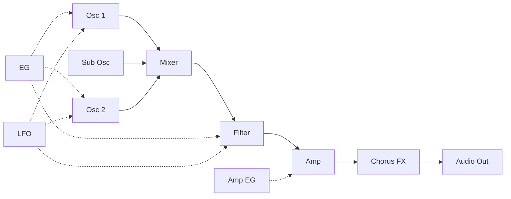
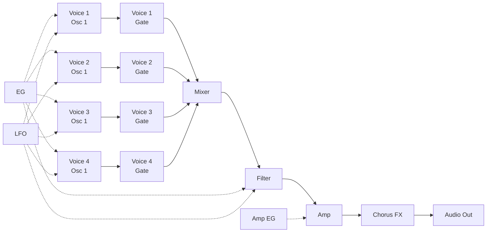
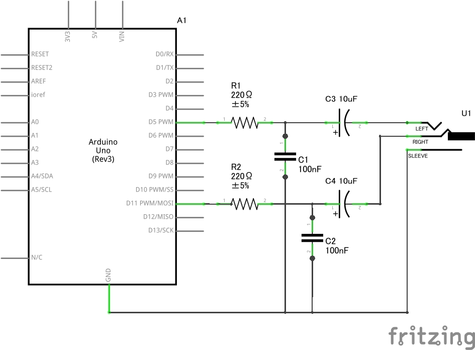
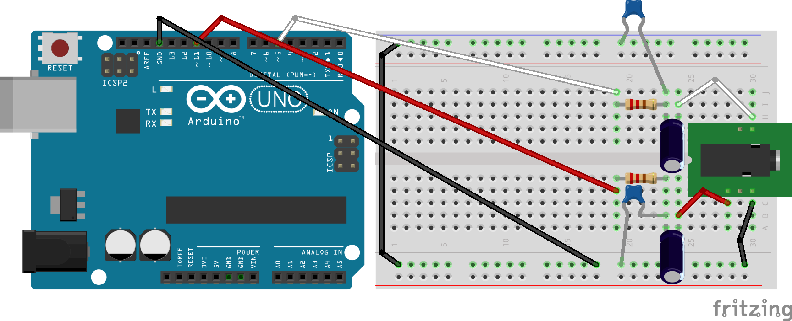

# Digital Synth VRA8-U v2.2.1

- 2023-05-04 ISGK Instruments
- <https://github.com/risgk/digital-synth-vra8-u>

## Concept

- Monophonic/Paraphonic United Synthesizer for Arduino Uno
    - Monophonic Mode: 1-Voice, 2-Oscillator (with Sub Oscillator)
    - Paraphonic Mode: 4-Voice, 1-Oscillator
    - Built-in Chorus FX
    - Controlled by MIDI: VRA8-U is MIDI Sound Module
- The 8th in the Digital Synth VRA8 series that pushes the limits of the Arduino Uno

## Caution about Arduino AVR Boards Version

- We *strongly recommend* **Arduino AVR Boards version version 1.8.5 (or from 1.8.3 to 1.8.6)**
    - If you use another version, the sketch *may not work well*: CPU Busy LED (LED L) *may continue to be lit*

## Change History

- v2.2.1:
    - Separate Voice Mode Lgt (Legato) into Lgt (Legato) and LP (Legato Portamento)
    - Fix Voice Mode value 32 to be Mon (Monophonic) mode
- v2.1.0:
    - Make the VRA8-U main unit recognize Program Change #8-15 (It is valid when VRA8-U CTRL is not used)
    - Improve stability
- v2.0.0:
    - Add support for **VRA8-U type-16** (Special Edition with 16-bit Audio Output)
    - Modify Preset #3 and #5
- v1.4.0:
    - Add the parameter "Chorus Bypass [Off|On]"
- v1.3.0:
    - Rename the parameter "Osc 1 Shape II" to "Osc 1 Morph";
    - Remove SS (Shaped Saw Wave) from Osc 1 Wave, and change the behaviour of Osc 1 Morph for Pls (Pulse Wave);
    - Change the texts "EG Osc Dst [P|P2|S1]" and "LFO Osc Dst [P|P2|S1]" to "EG Osc Dst [P|2P|1S]" and "LFO Osc Dst [P|2P|1S]";
    - Change to reflect the Filter Cutoff parameter smoothly;
    - Improve stability (Reduce CPU busy time when receiving Note ON in paraphonic mode);
    - Fix a bug where the effect of LFO Osc Amt was inverted when LFO Osc Dst is 1S (Osc 1 Shape);
    - Fix a bug in which changing MIDI In * with VRA8-U CTRL did not invalidate the setting before the change;
    - Change to recommend Arduino AVR Boards version 1.8.5 (or 1.8.3);
    - Support Arduino Nano (ATmega328) with restrictions;
    - Add Recommended Circuit Diagram and Actual Wiring Diagram;
    - Rename "Parameter List" to "Parameter Guide"; Improve documentation; Other changes
- v1.2.1: Reverses the effect of the Osc 1 Shape II value for SS (Shaped Saw Wave)
- v1.2.0: Change the range of Osc 1 Shape from -64 -- +63 to 0 -- 127; Fix the comment on Osc 1 Shape II in VRA8-U CTRL
- v1.1.1: Reduce noise in Chorus Mode M and S2
- v1.1.0: Add SS (Shaped Saw Wave) to Osc 1 Wave; Add Osc 1 Shape II; Reduce noise when Chorus Delay Time changes; Improve Random Ctrl of VRA-8 CTRL not to change Amp Level; Improve notes for $$ and $$$; Other changes
- v1.0.1: Reduce noise when Osc 1 Shape changes; Fix Parameter List

## Features

- Serial MIDI In (38.4 kbps)
    - We recommend [Hairless MIDI<->Serial Bridge](https://projectgus.github.io/hairless-midiserial/) to connect PC
    - **NOTE**: A combination of a **MIDI Shield** (or MIDI Breakout) and a **power supply adapter** is *better* to avoiding USB noise
        - To use MIDI Shield (or MIDI Breakout), take `#define SERIAL_SPEED (31250)` (31.25 kbps) in `"DigitalSynthVRA8U.ino"`
        - Even using only the power supply adapter *significantly* reduces USB noise
- PWM Audio Out (Unipolar, Line Level) **L/Mono**: **Pin D5** (or D6), **R**: **Pin D11**
    - Sampling Rate: 31.25 kHz, PWM Rate: 62.5 kHz, Bit Depth: 8 bit
    - **NOTE**: When using the SparkFun MIDI Shield (DEV-12898), it should be modified to `#define L_MONO_AUDIO_OUT_PIN (6)` in `"DigitalSynthVRA8U.ino"`
    - We recommend adding RC filter (post LPF) circuits to reduce PWM ripples
        - A 1st-order LPF with a cutoff frequency 7.2 kHz (R = 220 ohm, C = 100 nF) works well
    - We recommend adding AC coupling capacitors to reduce DC components
        - A 10 uF electrolytic capacitor works well
- Files
    - `"DigitalSynthVRA8U.ino"` is a sketch for Arduino Uno Rev3 (ATmega328P)
    - `"make-sample-wav-file.cc"` is for Debugging on PC
        - Requiring GCC (g++) or other
        - `"make-sample-wav-file-cc.bat"` makes a sample WAV file (working on Windows)
    - `"generate-*.rb"` generates source files
        - Requiring a Ruby execution environment
- **VRA8-U type-16**
    - To operate **VRA8-U type-16** (Special Edition with 16-bit Audio Output), refer to [VRA8-U type-16 Operation Guide](/VRA8-U-type-16-Operation-Guide.md)

## Limitations

- Waveforms may slightly distort when receiving MIDI bytes continuously
    - At that time, CPU Busy LED (LED L) probably blink
    - Particularly noticeable with Note ON in paraphonic mode
- Especially when the waveform is square wave, the noise of chorus delay component is noticeable at high frequency

## Restricted Support for Arduino Nano

- If you want to run this sketch in Arduino Nano (ATmega328), you must reduce the sketch size as follows (and sound quality in the high frequency range will be degraded):
    - Modify `FOR_ARDUINO_NANO = false` to `FOR_ARDUINO_NANO = true` in `"generate-osc-table.rb"`, and execute this Ruby script
    - Alternatively, delete `"osc-table.h"`, and rename `"osc-table.h.FOR_ARDUINO_NANO.txt"` to `"osc-table.h"`

## VRA8-U CTRL

- `"vra8-u-ctrl.html"`: MIDI Controller (Editor) Application for VRA8-U, HTML App (Web App)
- We recommend using Google Chrome, which implements Web MIDI API
- On Windows, We recommend using [loopMIDI](https://www.tobias-erichsen.de/software/loopmidi.html) (virtual loopback MIDI cable) to connect VRA8-U
    - On Mac, a virtual MIDI bus (port) can be created by using the IAC bus
- Functions
    - VRA8-U CTRL converts Program Changes (#0-7 for PRESET, #8-15 for user programs) into Control Changes
    - When Program Change #127 is entered or Control Change #90 is changed from Off (63 or lower) to On (64 or higher), "Rand Ctrl" is processed
    - VRA8-U CTRL stores the current control values and the user programs (#8-15) in a Web browser (localStorage)
    - Current parameter values and user programs (#8-15) can be imported/exported from/to JSON files

## [Parameter Guide](/VRA8-U-Parameter-Guide.md)

## [MIDI Implementation Chart](/VRA8-U-MIDI-Implementation-Chart.md)

## Synthesizer Block Diagram

### Monophonic/Legato Mode

### Paraphonic Mode

## Recommended Circuit Diagram

This image was created with Fritzing.

## Actual Wiring Diagram

This image was created with Fritzing.
