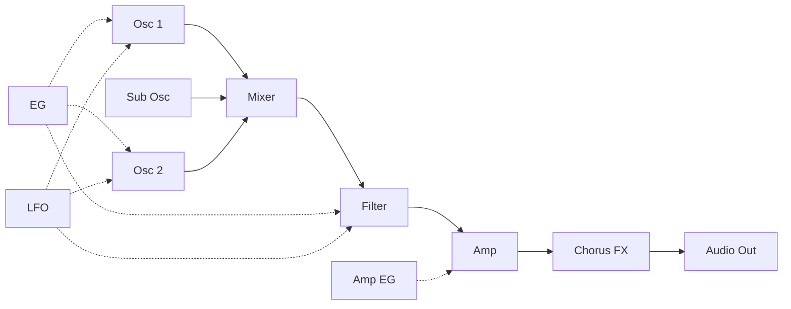
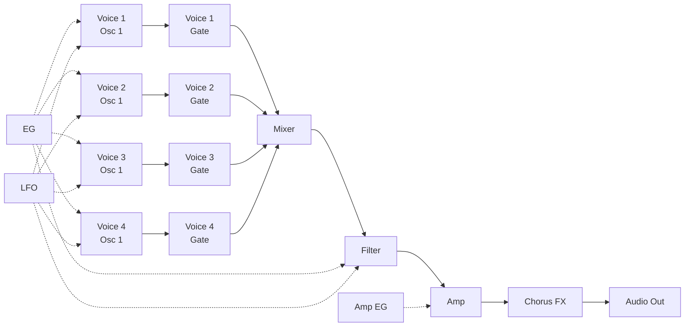

# Digital Synth PRA32-U v0.0.0

- 2023-05-04 ISGK Instruments
- <https://github.com/risgk/digital-synth-pra32-u>

## Overview

- Monophonic/Paraphonic United Synthesizer for Raspberry Pi Pico
    - Monophonic Mode: 1-Voice, 2-Oscillator (with Sub Oscillator)
    - Paraphonic Mode: 4-Voice, 1-Oscillator
    - Built-in Chorus FX
    - Controlled by MIDI -- PRA32-U is a MIDI sound module
- The sound of PRA32-U v1.0 is very similar to that of VRA8-U (type-16) v2.2
    - <https://github.com/risgk/digital-synth-vra8-u>
- I2S DAC (e.g. Pico Audio Pack) is required
- Arduino IDE and Raspberry Pi Pico/RP2040 (by Earle F. Philhower, III) core is required
    - Additional Board Manager URL: https://github.com/earlephilhower/arduino-pico/releases/download/global/package_rp2040_index.json

## Caution about Arduino AVR Boards Version

- Raspberry Pi Pico/RP2040 core version 3.2.0 is recommended
    - If you use another version, the sketch *may not work well*: CPU Busy LED (LED L) *may continue to be lit*

## Features

- Serial MIDI In (38.4 kbps)
    - We recommend [Hairless MIDI<->Serial Bridge](https://projectgus.github.io/hairless-midiserial/) to connect PC
    - **NOTE**: A combination of a **MIDI Shield** (or MIDI Breakout) and a **power supply adapter** is *better* to avoiding USB noise
        - To use MIDI Shield (or MIDI Breakout), take `#define SERIAL_SPEED (31250)` (31.25 kbps) in `"DigitalSynthPRA32U.ino"`
        - Even using only the power supply adapter *significantly* reduces USB noise
- PWM Audio Out (Unipolar, Line Level) **L/Mono**: **Pin D5** (or D6), **R**: **Pin D11**
    - Sampling Rate: 31.25 kHz, PWM Rate: 62.5 kHz, Bit Depth: 8 bit
    - **NOTE**: When using the SparkFun MIDI Shield (DEV-12898), it should be modified to `#define L_MONO_AUDIO_OUT_PIN (6)` in `"DigitalSynthPRA32U.ino"`
    - We recommend adding RC filter (post LPF) circuits to reduce PWM ripples
        - A 1st-order LPF with a cutoff frequency 7.2 kHz (R = 220 ohm, C = 100 nF) works well
    - We recommend adding AC coupling capacitors to reduce DC components
        - A 10 uF electrolytic capacitor works well
- Files
    - `"DigitalSynthPRA32U.ino"` is a Arduino sketch for Raspberry Pi Pico/RP2040 core
    - `"make-sample-wav-file.cc"` is for Debugging on PC
        - Requiring GCC (g++) or other
        - `"make-sample-wav-file-cc.bat"` makes a sample WAV file (working on Windows)
    - `"generate-*.rb"` generates source files
        - Requiring a Ruby execution environment

## Limitations

- Waveforms may slightly distort when receiving MIDI bytes continuously
    - At that time, CPU Busy LED (LED L) probably blink
    - Particularly noticeable with Note ON in paraphonic mode
- Especially when the waveform is square wave, the noise of chorus delay component is noticeable at high frequency

## PRA32-U CTRL

- `"pra32-u-ctrl.html"`: MIDI Controller (Editor) Application for PRA32-U, HTML App (Web App)
- We recommend using Google Chrome, which implements Web MIDI API
- On Windows, We recommend using [loopMIDI](https://www.tobias-erichsen.de/software/loopmidi.html) (virtual loopback MIDI cable) to connect PRA32-U
    - On Mac, a virtual MIDI bus (port) can be created by using the IAC bus
- Functions
    - PRA32-U CTRL converts Program Changes (#0-7 for PRESET, #8-15 for user programs) into Control Changes
    - When Program Change #127 is entered or Control Change #90 is changed from Off (63 or lower) to On (64 or higher), "Rand Ctrl" is processed
    - PRA32-U CTRL stores the current control values and the user programs (#8-15) in a Web browser (localStorage)
    - Current parameter values and user programs (#8-15) can be imported/exported from/to JSON files

## [Parameter Guide](/PRA32-U-Parameter-Guide.md)

## [MIDI Implementation Chart](/PRA32-U-MIDI-Implementation-Chart.md)

## Synthesizer Block Diagram

### Monophonic/Legato Mode

### Paraphonic Mode

