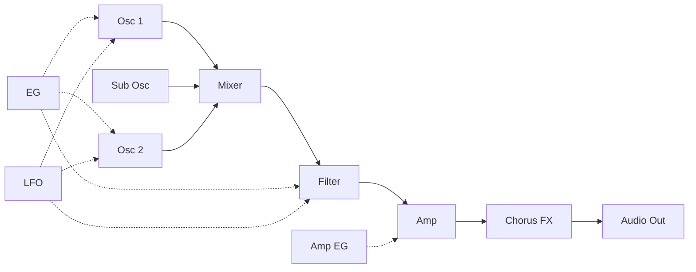
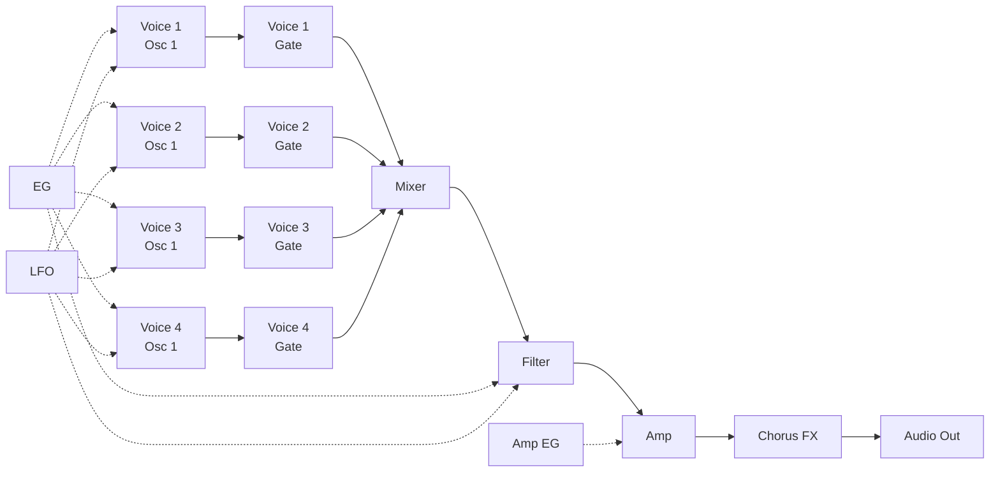

# Digital Synth PRA32-U v0.1.1

- 2023-05-09 ISGK Instruments
- <https://github.com/risgk/digital-synth-pra32-u>

## Overview

- Monophonic/Paraphonic United Synthesizer for Raspberry Pi Pico
    - Monophonic Mode: 1-Voice, 2-Oscillator (with Sub Oscillator)
    - Paraphonic Mode: 4-Voice, 1-Oscillator
    - Built-in Chorus FX
    - Controlled by MIDI -- PRA32-U is a MIDI sound module
- The sound of **PRA32-U v0.1** is very similar to that of **VRA8-U (type-16) v2.2**
    - <https://github.com/risgk/digital-synth-vra8-u>
- An **I2S DAC** hardware (e.g. Pico Audio Pack) is required
    - **NOTE**: Large noise is generated during the sketch upload!
- **Arduino IDE** and **Raspberry Pi Pico/RP2040** (by Earle F. Philhower, III) core are required
    - Additional Board Manager URL: <https://github.com/earlephilhower/arduino-pico/releases/download/global/package_rp2040_index.json>
    - Raspberry Pi Pico/RP2040 core **version 3.2.0** is recommended

## Change History

- v0.1.1: Fix a bug where 0-velocity Note ON is not processed as Note OFF
- v0.1.0: The first release

## Features

- USB MIDI In
    - **NOTE**: Select USB Stack "Adafruit TinuUSB" in the Arduino IDE "Tools" menu
    - MIDI Device Name: "Pico"
    - Serial MIDI (31.25 kbps or 38.4 kbps) can also be used instead of USB MIDI
        - Comment out `#define USE_USB_MIDI` and uncomment out `//#define USE_SERIAL1_MIDI` in `"Digital-Synth-PRA32-U.ino"`
- Audio Out
    - I2S DAC (e.g. PCM5100A), Sampling Rate: 31.25 kHz, Bit Depth: 16 bit
    - The default setting is for Pimoroni's [Pico Audio Pack](https://shop.pimoroni.com/products/pico-audio-pack)
    - Modify `I2S_DATA_PIN` and `I2S_BCLK_PIN` in `"Digital-Synth-PRA32-U.ino"` to match the hardware configuration
- Files
    - `"digital-synth-pra32-u-0.1.1.uf2"` (in the directory `"bin"`) is a UF2 file for Pico Audio Pack
    - `"Digital-Synth-PRA32-U.ino"` is a Arduino sketch for Raspberry Pi Pico/RP2040 core
    - `"pra32-u-make-sample-wav-file.cc"` is for debugging on PC
        - GCC (g++) for PC is required
        - `"pra32-u-make-sample-wav-file-cc.bat"` makes a sample WAV file (working on Windows)
    - `"pra32-u-generate-*.rb"` generates source or header files
        - A Ruby execution environment is required

## PRA32-U CTRL

- `"pra32-u-ctrl.html"`: MIDI Controller (Editor) Application for PRA32-U, HTML App (Web App)
- We recommend using Google Chrome, which implements Web MIDI API
- Select "Pico" in the list "MIDI Out"
- Functions
    - PRA32-U CTRL converts Program Changes (#0-7 for PRESET, #8-15 for user programs) into Control Changes
    - When Program Change #127 is entered or Control Change #90 is changed from Off (63 or lower) to On (64 or higher), "Rand Ctrl" is processed
    - PRA32-U CTRL stores the current control values and the user programs (#8-15) in a Web browser (localStorage)
    - Current parameter values and user programs (#8-15) can be imported/exported from/to JSON files

## [Parameter Guide](/PRA32-U-Parameter-Guide.md)

## [MIDI Implementation Chart](/PRA32-U-MIDI-Implementation-Chart.md)

## Synthesizer Block Diagram

### Monophonic/Legato Mode

### Paraphonic Mode

## License

**Digital Synth PRA32-U v0.1.1 by ISGK Instruments (Ryo Ishigaki)**

To the extent possible under law, ISGK Instruments (Ryo Ishigaki)
has waived all copyright and related or neighboring rights
to Digital Synth PRA32-U v0.1.1.

You should have received a copy of the CC0 legalcode along with this
work.  If not, see <http://creativecommons.org/publicdomain/zero/1.0/>.
