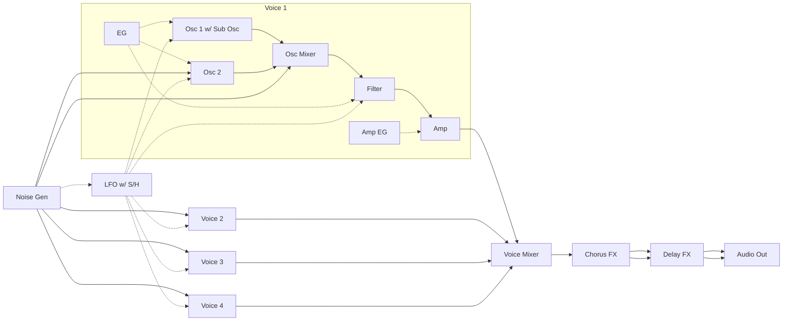
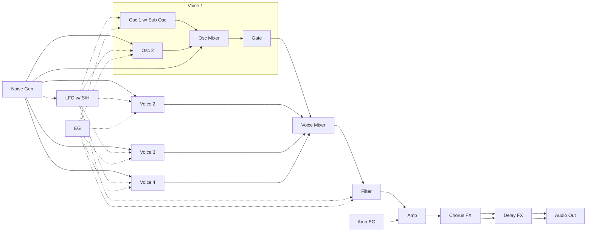
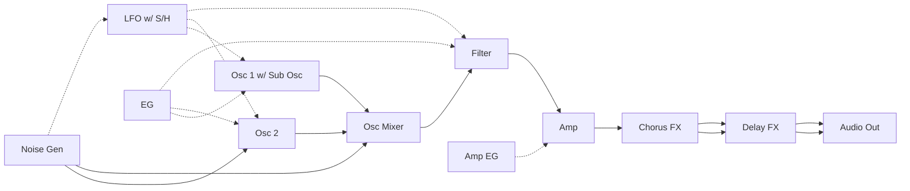

# Digital Synth PRA32-U v1.1.1

- 2023-12-24 ISGK Instruments
- <https://github.com/risgk/digital-synth-pra32-u>


## Overview

- 4 Voice Polyphonic/Paraphonic Synthesizer for Raspberry Pi Pico/RP2040
    - Built-in Chorus and Delay FX
    - Controlled by MIDI -- PRA32-U is a MIDI sound module
- Modifiable with Arduino IDE and Arduino-Pico (by Earle F. Philhower, III)
- An **I2S DAC** hardware (e.g. Pimoroni Pico Audio Pack and Waveshare Pico-Audio) is required
- Prebuilt UF2 files ("bin")
    - "Digital-Synth-PRA32-U-1.1.1-Pimoroni-Pico-Audio-Pack.uf2" is for Raspberry Pi Pico and Pimoroni Pico Audio Pack


## Change History

- v1.2.0: Change the numbers and the values of Control Changes (Voice Mode, LFO Wave,
  Filter Mode, EG Amp Mod, and Release = Decay);
  Increase DMA buffer size for future feature additions (audio latency: 2.7 ms -> 5.3 ms);
  Use 2 cores for signal processing for future feature additions; Renew High Pass Filter;
  Add Delay Mode (Ping Pong Delay); Support Breath Controller (Breath Filter Amt and Breath Amp Mod);
  Modify Presets; Fixed an oscillation problem caused by Delay Feedback; Add PWM audio output option (experimental) 
- v1.1.1: Revert Filter clipping in High Pass mode
- v1.1.0: Fix Filter clipping (behavior during oscillation); Extend Pitch Bend Range;
  Delete the code for Waveshare Pico-Audio Rev2.1
- v1.0.3: Fix a problem with received MIDI messages being dropped; Improve README; Fix UF2 files
- v1.0.2: Turn MIDI Thru Off
- v1.0.1: Fix unstable PRA32-U CTRL operation when using Serial MIDI (DIN/TRS MIDI); Fix README
- v1.0.0: Change Control Numbers of Control Changes;
  Change the meanings of the values of Osc 1/2 Wave, Voice Mode, and LFO Wave; Add Sine Wave to Osc 1 and 2;
  Limit the change range and the change rate of Osc 1 Shape; Change Noise specifications;
  Change Sub Osc Triangle Wave to Sine Wave; Change LFO Triangle Wave 2 to Sine Wave;
  Improve resolution of Filter Resonance; Limit the change rate of Filter Cutoff due to modulation;
  Change Amp Level to Amp Gain; Change Chorus Mode to Chorus Mix; Add Delay Fx;
  Delete Chorus Delay Time, Chorus Bypass, and Pitch Bend by CC; Update Presets; Other changes
- v0.4.0 (Prototype): Extend Osc 2 Coarse range; Change Osc 2 Fine curve; Rename "Osc 2 Fine" to "Osc 2 Pitch";
  Change LFO Osc/Filter Amt curve; Update Presets
- v0.3.1 (Prototype): Adjust smoothing time when parameters change; Update Presets; Fix LFO Osc/Filter Amt; Other changes
- v0.3.0 (Prototype): Extend Note Number range; Remove drift of Oscillators; Improve Triangle Wave; Change Portamento curve;
  Improve Filter Low Cut Mode; Rename Filter Mode LC (Low Cut) to HP (High Pass); Modify Filter coefficients;
  Change EG curve; Extend LFO Rate curve; Change LFO Fade Time; Change Chorue Rate curve; Update Presets;
  Fix Filter Key Track (Fix problem with strange sound when pitch is outside of note number range);
  Fix behavior when Portamento is 0 (Off); Other changes
- v0.2.0 (Prototype): Change Sampling Rate to 48000 Hz; Support MCLK for I2S; Support Polyphonic Mode;
  Extend Filter Cutoff frequency change range to 10+ octaves;
  Change "Mixer Sub Osc" to "Mixer Noise/Sub Osc"; Add "EG Amp Mod", "Release = Decay", and "Filter Mode";
  Enable Osc 1 Shape, Morph, Noise/Sub Osc, and Osc 2 in Paraphonic and Polyphonic Modes; Other changes
- v0.1.0 (Prototype): The first release


## Preparation for modification

- Please install **Arduino IDE**
    - **NOTE**: Large noise is generated during the sketch upload if other than Update Method: "Default (UF2)" is used
    - Info: <https://www.arduino.cc/en/software>
- Please install Arduino-Pico = **Raspberry Pi Pico/RP2040** (by Earle F. Philhower, III) core
    - Additional Board Manager URL: <https://github.com/earlephilhower/arduino-pico/releases/download/global/package_rp2040_index.json>
    - Info: <https://github.com/earlephilhower/arduino-pico>
    - Raspberry Pi Pico/RP2040 core **version 3.6.2** is recommended
- Please install **MIDI Library** (by Francois Best, lathoub)
    - Info: <https://github.com/FortySevenEffects/arduino_midi_library>
    - MIDI Library **version 5.0.2** is recommended


## Features

### MIDI Input

#### USB MIDI Input (Default)

- MIDI Device Name: "Digital Synth PRA32-U"
- **NOTE**: Select USB Stack: "Adafruit TinyUSB" in the Arduino IDE "Tools" menu


#### Serial MIDI Input (Optional)

- Serial MIDI can also be used instead of USB MIDI
- Comment out `#define USE_USB_MIDI` and uncomment out `//#define USE_SERIAL1_MIDI`
  in "Digital-Synth-PRA32-U.ino" and modify `SERIAL1_MIDI_SPEED`
- Speed: 31.25 kbps (default) or 38.4 kbps
- GP0 and GP1 pins are used by UART0 TX and UART0 RX
- DIN/TRS MIDI is available by using (and modifying) Adafruit MIDI FeatherWing Kit, for example
    - Adafruit [MIDI FeatherWing Kit](https://www.adafruit.com/product/4740)
    - 木下研究所 [MIDI-UARTインターフェースさん キット](https://www.switch-science.com/products/8117) (Shipping to Japan only)
    - necobit電子 [MIDI Unit for GROVE](https://necobit.com/denshi/grove-midi-unit/) (Shipping to Japan only)


### Audio Output

#### I2S Audio Output (Default)

- Use an I2S DAC (e.g. Texas Instruments PCM5100A and Cirrus Logic CS4344), Sampling Rate: 48 kHz, Bit Depth: 16 bit
- **NOTE**: The RP2040 system clock (sysclk) changes to overclocked 147.6 MHz by I2S Audio Library setSysClk()
- Modify `I2S_DAC_MUTE_OFF_PIN`, `I2S_DATA_PIN`, `I2S_MCLK_PIN`, `I2S_MCLK_MULT`, `I2S_BCLK_PIN`, and `I2S_SWAP_BCLK_AND_LRCLK_PINS`
  in "Digital-Synth-PRA32-U.ino" to match the hardware configuration
- The default setting is for Pimoroni [Pico Audio Pack](https://shop.pimoroni.com/products/pico-audio-pack) (PIM544)
```
#define I2S_DAC_MUTE_OFF_PIN            (22)
#define I2S_DATA_PIN                    (9)
//#define I2S_MCLK_PIN                    (0)
//#define I2S_MCLK_MULT                   (0)
#define I2S_BCLK_PIN                    (10)  // I2S_LRCLK_PIN is I2S_BCLK_PIN + 1
#define I2S_SWAP_BCLK_AND_LRCLK_PINS    (false)
```
- The following is setting is for [Pimoroni Pico VGA Demo Base](https://shop.pimoroni.com/products/pimoroni-pico-vga-demo-base) (PIM553)
  and [Pimoroni Pico DV Demo Base](https://shop.pimoroni.com/products/pimoroni-pico-dv-demo-base) (PIM588)
```
//#define I2S_DAC_MUTE_OFF_PIN            (0)
#define I2S_DATA_PIN                    (26)
//#define I2S_MCLK_PIN                    (0)
//#define I2S_MCLK_MULT                   (0)
#define I2S_BCLK_PIN                    (27)  // I2S_LRCLK_PIN is I2S_BCLK_PIN + 1
#define I2S_SWAP_BCLK_AND_LRCLK_PINS    (false)
```
- The following is setting is for Waveshare Pico-Audio Initial Version (WAVESHARE-20167)
```
//#define I2S_DAC_MUTE_OFF_PIN            (0)
#define I2S_DATA_PIN                    (26)
//#define I2S_MCLK_PIN                    (0)
//#define I2S_MCLK_MULT                   (0)
#define I2S_BCLK_PIN                    (27)  // I2S_LRCLK_PIN is I2S_BCLK_PIN + 1
#define I2S_SWAP_BCLK_AND_LRCLK_PINS    (false)
```
- The following is setting is for [Waveshare Pico-Audio](https://www.waveshare.com/wiki/Pico-Audio) Rev2.1 Version (WAVESHARE-20167)
```
//#define I2S_DAC_MUTE_OFF_PIN            (0)
#define I2S_DATA_PIN                    (22)
#define I2S_MCLK_PIN                    (26)
#define I2S_MCLK_MULT                   (256)
#define I2S_BCLK_PIN                    (27)  // I2S_LRCLK_PIN is I2S_BCLK_PIN + 1
#define I2S_SWAP_BCLK_AND_LRCLK_PINS    (true)
```


#### PWM Audio Output (Optional) (Experimental)

- PWM Audio can also be used instead of I2S
    - If PWM Audio is selected, Polyphonic Mode is disabled and Paraphonic Mode is used instead (due to lack of CPU power)
    - See "PWM audio" in [Hardware design with RP2040](https://datasheets.raspberrypi.com/rp2040/hardware-design-with-rp2040.pdf)
      for details on PWM audio
- Uncomment out `//#define USE_PWM_AUDIO_INSTEAD_OF_I2S`
  in "Digital-Synth-PRA32-U.ino" and modify `PWM_AUDIO_L_PIN` and `PWM_AUDIO_R_PIN`
- The following is setting is for Pimoroni Pico VGA Demo Base (PIM553)
```
#define PWM_AUDIO_L_PIN                 (28)
#define PWM_AUDIO_R_PIN                 (27)
```


## Files

- "Digital-Synth-PRA32-U.ino" is a Arduino sketch for Raspberry Pi Pico/RP2040 core
    - Modify `MIDI_CH` to change the MIDI Channel
- "pra32-u-make-sample-wav-file.cc" is for debugging on PC
    - GCC (g++) for PC is required
    - "pra32-u-make-sample-wav-file-cc.bat" makes a sample WAV file (working on Windows)
- "pra32-u-generate-*.rb" generates source or header files
    - A Ruby execution environment is required


## PRA32-U CTRL

- "pra32-u-ctrl.html": MIDI Controller (Editor) Application for PRA32-U, HTML App (Web App)
    - Modify `MIDI_CH` to change the MIDI Channel
- We recommend using Google Chrome, which implements Web MIDI API
- Select "Digital Synth PRA32-U" in the list "MIDI Out"
- Functions
    - PRA32-U CTRL converts Program Changes (#0-7 for PRESET, #8-15 for user programs) into Control Changes
    - When Program Change #127 is entered or Control Change #111 is changed from Off (63 or lower) to On (64 or higher), "Rand Ctrl" is processed
    - PRA32-U CTRL stores the current control values and the user programs (#8-15) in a Web browser (localStorage)
    - Current parameter values and user programs (#8-15) can be imported/exported from/to JSON files


## [Parameter Guide](/PRA32-U-Parameter-Guide.md)


## [MIDI Implementation Chart](/PRA32-U-MIDI-Implementation-Chart.md)


## Synthesizer Block Diagram

### Polyphonic Mode




### Paraphonic Mode




### Monophonic Mode




## License


**Digital Synth PRA32-U v1.1.1 by ISGK Instruments (Ryo Ishigaki)**

To the extent possible under law, ISGK Instruments (Ryo Ishigaki)
has waived all copyright and related or neighboring rights
to Digital Synth PRA32-U v1.1.1.

You should have received a copy of the CC0 legalcode along with this
work.  If not, see <http://creativecommons.org/publicdomain/zero/1.0/>.
