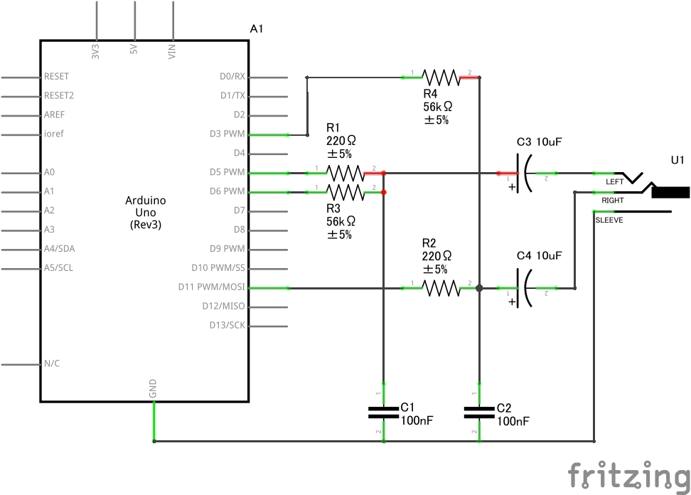
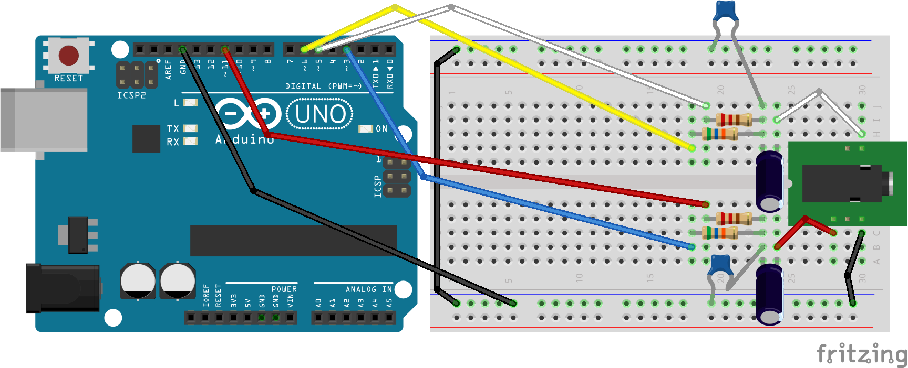

# Digital Synth VRA8-U type-16 Operation Guide v2.2.1

- 2023-05-04 ISGK Instruments
- <https://github.com/risgk/digital-synth-vra8-u>

## Concept

- **Digital Synth VRA8-U type-16**
    - Digital Synth VRA8-U Special Edition with 16-bit Audio Output

## Features

- To operate **VRA8-U type-16**, uncomment out `//#define ENABLE_16_BIT_OUTPUT` in `"DigitalSynthVRA8U.ino"`
- PWM Audio Out
    - L channel, high 8-bit: Pin D5 (or D6)
    - L channel, low 8-bit: Pin D6 (or D5)
    - R channel, high 8-bit: Pin D11 (Fixed)
    - R channel, low 8-bit: Pin D3 (Fixed)
    - **NOTE**: When using the SparkFun MIDI Shield (DEV-12898), do not mount S4 (D3) and LED2 GREEN (D6)
- Limitations
    - Chorus Mode "Mono Chorus" and "Stereo 2-phase Chorus" are not available
    - The effect of Chorus Depth and Chorus Delay Time are halved
    - Refer to [Parameter Guide](/VRA8-U-Parameter-Guide.md) for details
- Please use **VRA8-U type-16 CTRL** (`"vra8-u-type-16-ctrl.html"`)

## Recommended Circuit Diagram

This image was created with Fritzing.

## Actual Wiring Diagram

This image was created with Fritzing.
